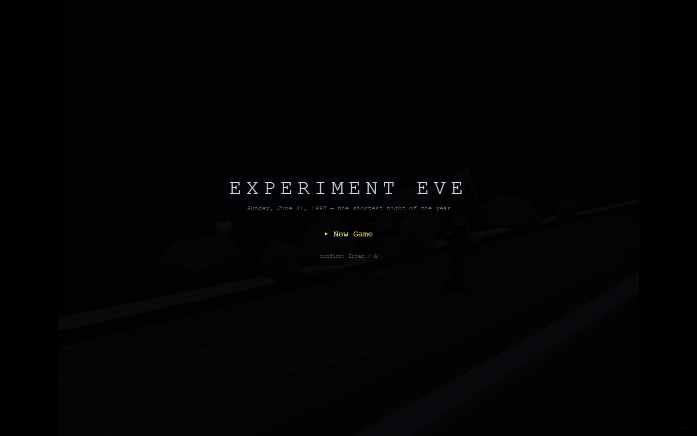
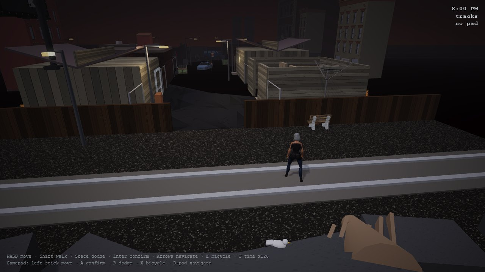
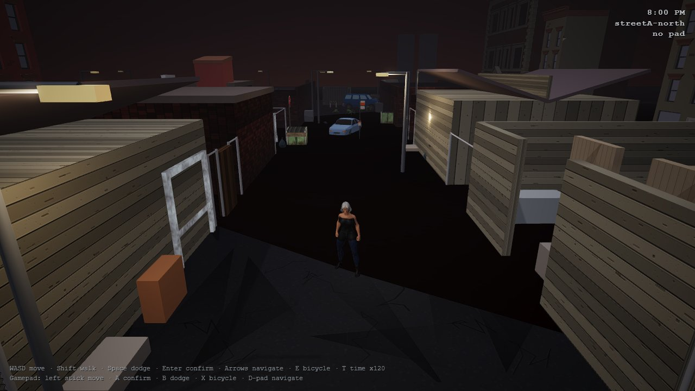
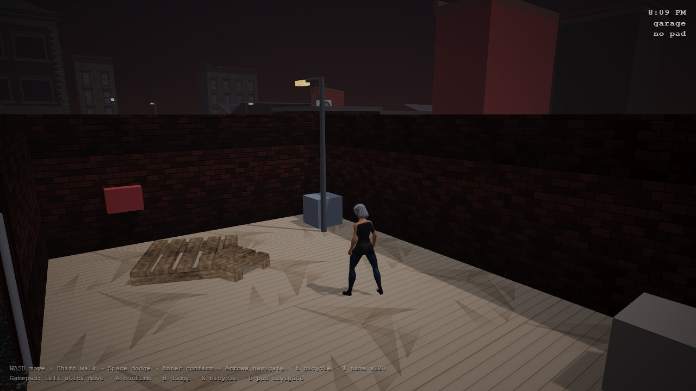

# ExperimentEve

A browser action RPG with a PS1 look, set over one real-time night in a fictional 1998 coastal town, with ATB battles in the Parasite Eve tradition. Written in TypeScript on Three.js and Babylon.js.

    



There is no hosted build. Run it locally with Vite (see Quick start).

## Why

- Play a love letter to late-90s PlayStation games: low-resolution rendering, vertex snap, dithering and fixed cameras, in a browser tab.
- Live through one night in real time: Sunday, June 21, 1998, the shortest night of the year, with a world clock and hourly City Hall chimes.
- Fight with a gauge, not a button: real time runs until the ATB gauge fills, then the world stops while you choose where to put the round.
- Explore a town that is a wink at a real place: every location in the gazetteer is a nod-and-wink rename of the Newport, Rhode Island area as it was in 1998.
- Compare two engines side by side: the same game is being built in Three.js and in Babylon.js in one repo.

## Features

### Three build

The original build, with most of the game systems:

- PS1 render pipeline: a 640x480 internal target upscaled with nearest-neighbour filtering, ordered Bayer dithering, 15-bit colour quantization, vertex snap and affine texture warp, letterboxed to 4:3 (`three/src/render/ps1`).
- Fixed cameras with camera zones and a direction latch, gamepad-first input with keyboard fallback.
- Parasite Eve style battle core with damage numbers, cover, smoke bombs and crafted weapons (`three/src/battle`).
- A bestiary of chimera species, including 20 humanoid "Afflicted", segmented "Grafted" bosses, a frog miniboss and the Puffergull (`three/src/enemies`).
- World systems: an A-Life world AI, scares, the Erasure squad, cats you can earn the trust of, chimeric DNA infusions, lockpicking with bobby pins, salvage, a pawnshop, inventory, stats, save points and a save system (`three/src/gameplay`, `three/src/ui`).
- A standalone character preview page (`three/character-preview.html`).

### Babylon build

The newer build, following the design document chapter by chapter (`babylon/src`):

- Chapter 2 core loop: Kat's movement and dodge, the fixed camera and Observer system, and the one-night world clock.
- Chapter 3 ATB battle: part targeting on real bones, Precision Aim, a Limit gauge, shot feedback and creatures that hit back.
- Kat as a rigged CC0 character with 43 animation clips and a procedurally painted outfit.
- A CC0 bestiary of eleven rigged creatures (frog, rat, snake, spider, wasp, bat, slime, two fish, shark, manta ray) with wandering wildlife.



### World and lore

- [docs/GAZETTEER.md](docs/GAZETTEER.md) maps every real place to its in-game name (Newport becomes Kingsport) and back-casts businesses to 1998.
- `universe/eve.universe.json` holds 128 lore entities, validated by `universe/universe.schema.json` and queried with the `universe` mini-CLI.



## Quick start

Prerequisites: Node.js and npm.

```bash
git clone https://github.com/mindattic/ExperimentEve.git
cd ExperimentEve
npm install
npm run dev:babylon
```

Open the URL Vite prints. Use `npm run dev:three` for the Three.js build.

Controls:

| Input | Keyboard | Gamepad |
| --- | --- | --- |
| Move | WASD or arrows | Left stick |
| Walk | Shift (keyboard is full speed otherwise) | |
| Confirm or attack | Enter or Z | A |
| Dodge or cancel | Space or X | B |
| Interact or bicycle | E or C | X |
| Menu | Esc | Start |
| Menu navigation | Arrows | D-pad |
| Speed up time | T | |

## Scripts

| Command | What it does |
| --- | --- |
| `npm run dev:three` | Vite dev server for the Three.js build |
| `npm run build:three` | Type-check and build to `dist/three` |
| `npm run preview:three` | Preview the built Three.js build |
| `npm run dev:babylon` | Vite dev server for the Babylon.js build |
| `npm run build:babylon` | Type-check and build to `dist/babylon` |
| `npm run preview:babylon` | Preview the built Babylon.js build |
| `npm run universe -- <command>` | Lore CLI: `validate`, `list [type]`, `get <id>`, `search <text>`, `stats`, `pull`, `push` |

Headless playtest of the Babylon build. It drives the real game in a browser already installed on the machine (no Playwright browser download), holds keys long enough for the game's edge detection, and writes screenshots to the output folder:

```bash
node scripts/playtest.mjs [url] [outDir]
```

## How it works

```text
three/ and babylon/          two engines, one game, shared public/ assets
  src/core      input (gamepad first, keyboard fallback), clock, world clock
  src/camera    fixed cameras, camera zones, movement basis
  src/level     level01 greybox and props
  src/player    Kat: rig, controller, outfit
  src/enemies   creatures, world AI
  src/battle    ATB battle, combat effects
  src/render    PS1 pipeline (Three) and render setup (Babylon)
  src/ui, src/audio, src/gameplay, src/physics

public/models/  CC0 and bundled models: retro-urban, city-pack, kat, creatures, michelle, soldier
universe/       lore entities, schema, snapshot
scripts/        playtest.mjs (headless playtest), universe.mjs (lore CLI)
docs/           GAZETTEER.md
```



## Limitations

- This is an experiment in active development. The Babylon build currently implements the core loop and the battle; ecology, stealth, saves and crafting are later chapters there.
- The title screen above is from an older local build of the Three.js version; the playtest captures are from the Babylon build.
- The source and license of the "City Pack" models are not yet recorded (see CREDITS.md).

## Documentation

- [docs/GAZETTEER.md](docs/GAZETTEER.md): the world's real-to-in-game naming table and 1998 back-casting rules
- [CREDITS.md](CREDITS.md): asset sources and licenses
- [AGENTS.md](AGENTS.md): instructions for AI agents working in this repo

## License

This repo has no LICENSE file. All rights reserved for the code. Third-party models keep their own licenses (mostly CC0); see [CREDITS.md](CREDITS.md).

Part of [MindAttic](https://mindattic.com) — see more projects at [github.com/mindattic](https://github.com/mindattic). Related: [ExperimentRTS](https://github.com/mindattic/ExperimentRTS).
